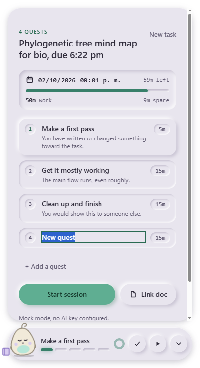

# Pensum

A tiny companion that helps when you can't help yourself: **starting, getting unstuck, coming back.**
It floats at the bottom of your screen, plans your goal into small quests, and looks only at **the one
window you pick**, only during a session. It asks, it never scolds, and the model never decides you are
finished: you click.



## Try it

- **Windows:** [download Pensum 1.0.0 (portable exe)](https://github.com/VoidRubik/pensum/releases/latest). Double-click, no install, no admin, live AI with no setup.
- **Video:** VIDEO LINK

Windows may warn because the app is unsigned → **More info → Run anyway.** The first launch takes a few seconds
(a portable exe unpacks itself).

## How it works

1. **Goal.** Type what you want to finish ("write my water cycle essay, due 6 pm"). You get 3 to 5 small quests, the first one tiny.
2. **Stuck?** Start a session and pick the window you work in. The footsteps button names one concrete next step from what is on screen.
3. **Drift.** Wander off for two minutes and the pet asks if that is still the task (a local rule: no screenshot, no model).
4. **Confirm.** When you think a quest is done the pet shows what it sees and **you** click to confirm. The model never completes a quest.
5. **Recap.** Finish the last quest for the recap, or close the work window and watch the pet fall asleep and offer to pick it up again.

## Privacy

- Frames are **never saved**. Each look sends one frame of the window you picked, its title (private-window, password and banking words dropped), and nothing else, to Google Gemini **through the Pensum server** for that one answer. With your own key (Settings → gear) the app calls Gemini directly and may also send the text of a document you link or have open in Word.
- **On the free tier Google may use what it receives to improve its products, and humans may review it.**
- The Pensum server keeps no request bodies and does not log them. Its rate limiter stores your IP address as a counter key, which expires within a day.
- The usage ledger on your PC stores only model, token counts, timing and status. Pause and End session clear the chosen window, the sampler and the in-memory frame.
- By default the overlay is hidden from screenshots and screen recordings (content protection); the tray toggle "Hide from screen recordings" turns that off, for example to record a demo. Frames sent to Gemini come only from the picked window, so the overlay is never in them either way.
- Hardening: sandboxed renderer with context isolation, navigation / new-window / permission requests denied, the main process reads only document files you chose in the link dialog, PowerShell helpers get no API keys.

## Tech stack

Electron 44 + electron-builder (portable exe) · vanilla HTML/CSS/JS renderer · plain Vercel Node functions (`api/pet.js`) · Upstash Redis rate limits · zod request validation · Node's built-in test runner · Playwright for end-to-end tests.

Models: `gemini-3.5-flash-lite` through the Pensum server (plans and looks). With your own key: `gemini-3.5-flash` for plans and `gemini-3.5-flash-lite` for looks.

## Why desktop

Pensum looks at the one real window you pick, and follows which app is in front, so it can notice you wandered off without ever screenshotting your other apps. A browser tab can't do that, which is why Pensum is a Windows desktop app with no web version.

## Limits

The server allows 15 requests per minute and 150 per day per IP, plus a global daily budget (`PENSUM_GLOBAL_DAY`, set to 70% of the model's free-tier requests per day; the exact free-tier figure was not verified at the time of writing). When a limit is hit the app keeps working in MOCK MODE.

Known limits: the app is Windows-only (window capture and focus tracking use Win32 and PowerShell); free-tier Gemini latency has long tails (up to 16 s), looks time out and the app carries on; not yet verified: use on a real, long task and multi-monitor drag with different DPI.

## Run locally

```
git clone https://github.com/VoidRubik/pensum.git
cd pensum
npm install
npm start
```

Needs Node 22.12 or newer. With no network key the dev build runs in **mock mode** unless `PENSUM_API` points at a deployed server. To use your own key, open Settings (the gear) and paste a free [Google AI Studio](https://aistudio.google.com/) key, or put `GEMINI_API_KEY=...` in `.env` in the repo or in `%APPDATA%\pensum\.env`. A packaged build never contains a key. Environment variables use the `PENSUM_` prefix (`PENSUM_MOCK=1` forces mock mode).

If the window never appears, your shell may have `ELECTRON_RUN_AS_NODE=1` set (VS Code terminals do): unset it before `npm start`. Build the portable exe with `npm run dist` (output in `dist/`).

## Tests

```
npm install
npm test            # node --test, any OS
```

The end-to-end suites drive the real Electron window (Windows). Run them in mock mode so no model call can happen:

```
PENSUM_MOCK=1 GEMINI_API_KEY= node scripts/e2e-step2.js      # also e2e-step8/10/11, e2e-polish, e2e-bugs, e2e-security, e2e-ship
```

(PowerShell: `$env:PENSUM_MOCK='1'; $env:GEMINI_API_KEY=''`.)

## Credits

Built Sep 26 – Oct 4, 2026 for LovHack S3. Every library, service and template used:

1. Electron 44 (MIT): desktopCapturer, Tray, powerMonitor, nativeTheme, net
2. Node.js 22 and its built-in test runner
3. Google Gemini API, `gemini-3.5-flash`: quests with your own key
4. Google Gemini API, `gemini-3.5-flash-lite`: looks, and plans through the server
5. Google AI Studio free-tier key
6. Vercel: serverless functions and a one-page landing
7. Upstash Redis and `@upstash/ratelimit` / `@upstash/redis`: shared rate limits
8. zod: strict request validation
9. Playwright (`playwright-core`, `_electron`) for the end-to-end tests
10. electron-builder for the portable exe
11. GitHub, the gh CLI and GitHub Actions
12. Win32 `user32.dll` via PowerShell `Add-Type` (foreground window)
13. Microsoft Word COM automation (live document text)
14. .NET `System.IO.Compression` (reading `.docx`)
15. Claude Code (Anthropic): Opus 5.5 for planning and review, Sonnet 5.5 for building and independent reviews
16. Claude Design: "Pensum App UI v2" and "Pet Motion" (pets Tuck and Kip) plus the SVG icon sprite
17. Agent skills used while building: superpowers, ponytail, impeccable, emil-design-eng, ui-ux-pro-max
18. AIOS, the author's personal context system (brief, task cards, memory)
19. Segoe UI Variable and Cascadia Mono (system fonts)
20. Electron security checklist (docs)

MIT licensed: [`LICENSE`](LICENSE).
